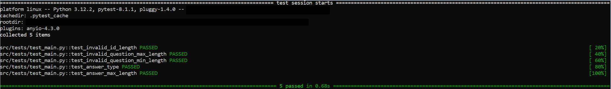
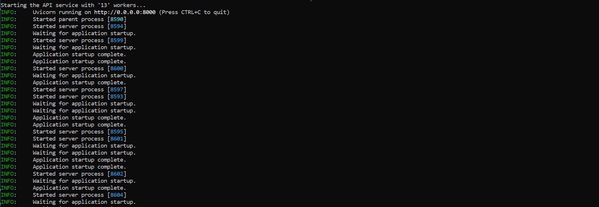

# Overview
This is a simple API service with one endpoint, /question, implemented using the FastAPI library. The solution can be deployed in several ways, as described in the following chapters. The same applies to the input validation approach: in one case, input validation is performed using the Pydantic library, while in the other case, it is achieved through custom implemented validators. Test cases for API input/output sanity checks were implemented specifically for the scenario using custom validators.

The API accepts user input with 'id' and 'question' fields and returns an 'answer' string of random length composed of random characters. Users must provide input in the following format::
    
    {
        "id": str(min_length: 1),
        "question": str(min_length: 1, max_length: 512)
    }

The API returns answer in following format:

    {
        "answer": str(min_length: 10, max_length: 1024)
    }

# Example 

**user input:**
```bash
curl -X POST -H "Content-Type: application/json" -d '{"id": "id_value", "question": "question_value"}' http://127.0.0.1:8000/question
```
**API response:**
```bash
{"answer":"z|,1^,+@S)Rhejem>'KMFq2_s:XErADySxpmDIoqEm81r\\0%38{fhH7mH[.S>d%(sT9e'R]Nhh\\xx-.H~hEkY|_U)C#,_0\\B8/O($yjJv5-=clU)%r@DpHw:7>2p5"}
```

## Folder structure
Solution folder structure is depicted in the scheme below.

```
└── api_startup.sh
└── Dockerfile
└── docker_commands.sh
└── docker_api_startup.sh
└── README.md
└── requirements.txt
└── 📁src
    └── answers.py
    └── app_manual_checks.py
    └── app_pydantic_checks.py
    └── exception_message.py
    └── request_validators.py
    └── __init__.py
    └── 📁test
        └── __init__.py
        └── test_main.py
```

## Custom input validations
This version of API implementation utilizes custom input validators. Requests sent to the API are partially validated by the Pydantic Payload model and by custom validators, which are placed in the request_validators.py file. While not strictly necessary for this simple use case, this approach demonstrates the ability to implement more complex validators for input request checks beyond the functionalities provided by Pydantic models.

## pydantic input validations
For this particular use case, Pydantic input request validation should suffice. By defining a base model in the following manner:

```python
class Payload(BaseModel):
    """
    A Pydantic model that contains the id and question.
    
        Attributes:
            id (str): a unique identifier of length greater than 0
            question (str): a question of length between 1 and 512
    """
    id: str = Field(
        title="ID",
        description="A unique identifier",
        min_length=1
        )
    question: str = Field(
        title="Question",
        description="A question",
        min_length=1,
        max_length=512
        )
```

The input request is automatically checked for the following criteria:

- Both id and question must be of string type.
- The id value must have a minimum length of 1.
- The question value must have a minimum length of 1 and a maximum length of 512 characters.

## Testing

Tests for the custom validation API version have been implemented and can be found in the src/tests/test_main.py file. Below is a list of the implemented tests:

- test_invalid_id_length
- test_invalid_question_max_length
- test_invalid_question_min_length
- test_answer_type
- test_answer_max_length

A docstring has been written for each test function to describe what the test function tests.

# Installation

## Automatic installation and deployment
Please note that this approach has been tested and is applicable only in Linux or WSL (Windows Subsystem for Linux) environments.

For automatic installation and deployment of the API service, execute the following command in the project's root folder:
```
bash api_startup.sh
```
The script will first check if Miniconda is installed on the system. If not, the installation file will be downloaded and Miniconda will be installed. Then, the script will check if a Conda environment is created; if not, the environment will be created and all necessary packages will be installed into it. In the last step, the user will be prompted to choose between deploying the variant with custom or Pydantic validations.


API test cases are automatically triggered when the user chooses custom validations during the API deployment.

Once the script is successfully executed, the API is ready to handle requests:



You can try it out with the following command:

```bash
curl -X POST -H "Content-Type: application/json" -d '{"id": "id_value", "question": "question_value"}' http://127.0.0.1:8000/question
```

## Docker deployment
The API can also be deployed as a Docker container. To do so, first, check if Docker is installed on your system by running the following command:

```bash
docker --version
```

If docker is not installed, please follow these installation guides:

WSL: https://docs.docker.com/desktop/wsl/
Linux: https://docs.docker.com/engine/install/ubuntu/

To deploy the API with Docker, run the following script inside the project's root folder:

```bash
bash docker_api_startup.sh
```

or manually by executing following commands:

```bash
docker build -t api .
docker run -d -p 8000:8000 api
```

After you have finished testing the API, remember to stop the Docker image by executing the following command:

```bash
docker stop $(docker ps -q --filter ancestor=api )
```

## Manual instalation and deployment
**NOTE**: Manual installation is performed using conda here, but Python venv will also work.

The API can be installed and deployed manually as well. First, ensure that conda is installed on your system by running the following command in the terminal:

```bash
conda --version 
```

If conda is not installed, please execute the following commands in the terminal:
```bash
mkdir -p ~/miniconda3
wget https://repo.anaconda.com/miniconda/Miniconda3-latest-Linux-x86_64.sh -O ~/miniconda3/miniconda.sh
bash ~/miniconda3/miniconda.sh -b -u -p ~/miniconda3
rm -rf ~/miniconda3/miniconda.sh
eval "$(~/miniconda3/bin/conda shell.bash hook)"
conda init
export PATH=$PATH:~/miniconda3/bin/
```

Create and activate conda environment:

```bash
conda create -n restapi python=3.12.2
conda activate restapi
```

To install the packages needed for the API, navigate to the project's root folder and execute the following command:

```bash
pip install -r requirements.txt
```

To run predeployment tests execute:

```bash
pytest --verbose --pyargs src
```

To run the API with custom validators execute:

```bash
uvicorn src.app_custom_validations:app --workers 4 --host 0.0.0.0 --port 8000
```

or with pydantic validators:

```bash
uvicorn src.app_pydantic_validations:app --workers 4 --host 0.0.0.0 --port 8000
```

# Possible next steps

Since the solution was implemented to function as a Docker container, it is ready to be deployed to the cloud, for example, AWS ECR/ECS.

With a few modifications, this solution can also be uploaded as an AWS Lambda function and connected to AWS API Gateway.